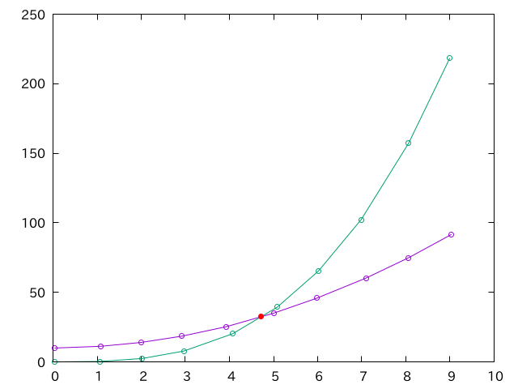

# 線分の交差判定及び交点特定

## 概要

二つの線分の交差判定、及び交点を探すサンプルコードです。二つの折れ線グラフが与えられた時に、その交点を探します。

## スクリプトの説明

### `makedata.rb`

二次曲線と三次曲線に対して、適当にノイズをのせたデータファイル`data1.dat`、`data2.dat`を出力します。

```sh
$ ruby makedata.rb
generated data1.dat
generated data2.dat
```

作成されるファイルはこんな感じです(乱数を使っているので毎回変わります)。

```txt
-0.013394435128284046 10.08807371402383
0.9152098186225176 10.910711103522843
1.9961287168976423 14.07590113239662
2.9486899395197925 18.691393553058457
4.018178002017 26.21480010232648
5.043529765577689 35.39444709158948
6.002949609050165 45.95794563620734
6.98940849099628 58.76456184464741
8.086175498918424 75.29057716585503
9.052045346704482 92.01235525945317
```

### `find_intersect.rb`

線分の交差判定をして、交点を探し、見つけた交点の座標を`intersection.dat`に出力するスクリプトです。

```sh
$ ruby  find_intersect.rb
reading data1.dat
reading data2.dat
generated intersection.dat

$ cat intersection.dat
4.706596552800452 32.37799160560815
```

### `intersection.plt`

折れ線グラフと交点を表示する`gnuplot`スクリプトです。正しく動作しているかの確認用です。

```sh
gnuplot intersection.plt
```

正しく動作すれば、こんな図ができます。



### `makefile`

上記の動作を一度にやるMakefileも用意してあります。

```sh
$ make
ruby makedata.rb
generated data1.dat
generated data2.dat
ruby find_intersect.rb
reading data1.dat
reading data2.dat
generated intersection.dat
gnuplot intersection.plt
```

## ライセンス

CC0です。好きなように使ってください。